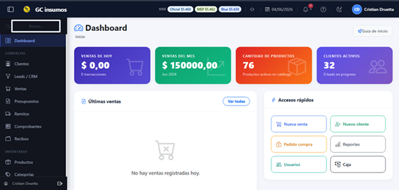
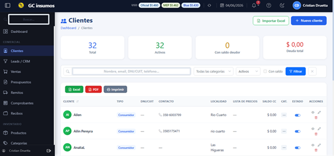
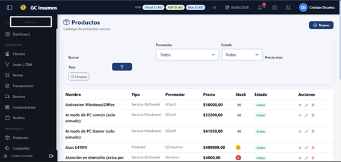
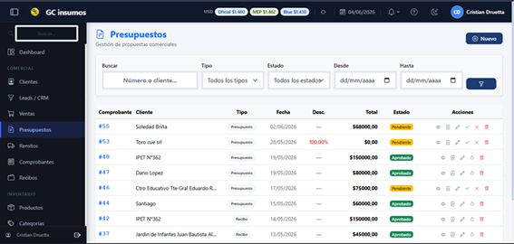
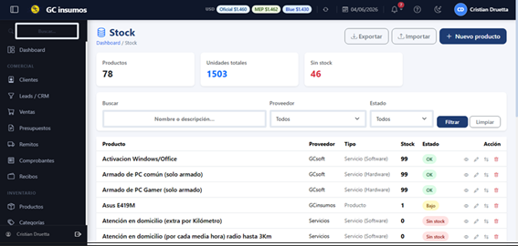
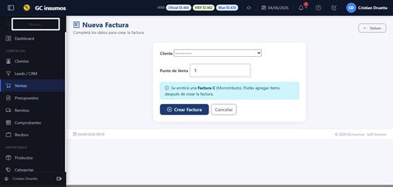

<p align="center">
  
</p>


# 🚀 Sistema integral de Gestios Comercial

Sistema integral de gestión comercial desarrollado con **Django**, **Django REST Framework**, **Next.js** y **TypeScript**.

Diseñado para servicios técnicos, comercios y pequeñas empresas que necesitan administrar clientes, productos, proveedores, stock, compras, cotizaciones, recibos, remitos y facturación desde una única plataforma.

---

## ✨ Características

### 👥 Gestión Comercial

* Gestión de clientes
* Gestión de proveedores
* Gestión de productos
* Gestión de categorías
* Gestión de marcas
* Gestión de leads

### 💰 Operaciones Comerciales

* Cotizaciones
* Recibos
* Remitos
* Compras
* Facturación
* Generación automática de documentos PDF

### 📦 Inventario

* Control de stock
* Movimientos de stock
* Seguimiento de existencias
* Historial de operaciones

### 📊 Dashboard y Reportes

* Métricas comerciales
* Indicadores de rendimiento
* Estadísticas de negocio
* Reportes generales

### 🔐 Seguridad

* Registro de usuarios
* Inicio de sesión
* Gestión de permisos

### 🔌 API REST

* Endpoints REST
* Serialización de datos mediante Django REST Framework
* Preparado para integraciones externas

---

## 🛠️ Tecnologías

### Backend

* Python
* Django
* Django REST Framework
* ReportLab

### Frontend

* Next.js 15
* React
* TypeScript
* Tailwind CSS

### Base de Datos

* PostgreSQL (Producción)
* SQLite (Desarrollo)

### DevOps

* GitHub Actions
* Render
* Gunicorn

---

## 🏗️ Arquitectura

```text
Frontend (Next.js)
        │
        ▼
API REST (Django REST Framework)
        │
        ▼
PostgreSQL / SQLite
```

---

## 📸 Capturas de Pantalla

<h3 align="center">Dashboard</h3>

<p align="center">
  
</p>

<h3 align="center">Clientes y Productos</h3>

<p align="center">
  
  
</p>

<h3 align="center">Cotizaciones y Stock</h3>

<p align="center">
  
  
</p>

<h3 align="center">Facturación</h3>

<p align="center">
  
</p>

---

## 📂 Estructura del Proyecto

```text
cotizador-3.0/
│
├── backend/
│   ├── cotizaciones/
│   ├── proyecto/
│   ├── templates/
│   ├── static/
│   └── manage.py
│
├── frontend/
│   ├── app/
│   ├── components/
│   ├── hooks/
│   └── public/
│
├── docs/
│   └── screenshots/
│
├── .github/
│   └── workflows/
│
├── manage.py
├── Procfile
├── render.yaml
├── build.sh
└── requirements.txt
```

---

## ⚙️ Instalación Local

### 1. Clonar el repositorio

```bash
git clone git@github.com:Cdruetta/cotizador-3.0.git
cd cotizador-3.0
```

### 2. Configurar Backend

Crear entorno virtual:

```bash
python -m venv venv
```

Windows:

```bash
venv\Scripts\activate
```

Linux / macOS:

```bash
source venv/bin/activate
```

Instalar dependencias:

```bash
pip install -r requirements.txt
```

Aplicar migraciones:

```bash
python manage.py migrate
```

Crear superusuario:

```bash
python manage.py createsuperuser
```

Iniciar servidor:

```bash
python manage.py runserver
```

Acceso:

```text
http://127.0.0.1:8000
```

Panel administrativo:

```text
http://127.0.0.1:8000/admin
```

---

### 3. Configurar Frontend

Instalar dependencias:

```bash
npm --prefix frontend install
```

Ejecutar entorno de desarrollo:

```bash
npm --prefix frontend run dev
```

Acceso:

```text
http://localhost:3000
```

---

## 🚀 Deploy en Render

### Build Command

```bash
./build.sh
```

### Start Command

```bash
gunicorn --chdir backend proyecto.wsgi:application
```

---

## 🧪 Testing

Ejecutar pruebas:

```bash
python manage.py test
```

Incluye:

* Tests de modelos
* Tests de vistas
* Tests de API
* Validación de funcionalidades principales

---

## ✅ Funcionalidades Implementadas

* [x] Clientes
* [x] Productos
* [x] Categorías
* [x] Marcas
* [x] Proveedores
* [x] Compras
* [x] Stock
* [x] Movimientos de stock
* [x] Cotizaciones
* [x] Recibos
* [x] Remitos
* [x] Dashboard
* [x] Reportes
* [x] API REST
* [x] Gestión de usuarios
* [x] Generación de PDF

---

## 🛣️ Roadmap

### Próximas funcionalidades

* [ ] Integración completa AFIP / ARCA
* [ ] Facturación electrónica automática
* [ ] Dashboard avanzado con gráficos
* [ ] Exportación a Excel
* [ ] Sistema multiempresa
* [ ] Notificaciones automáticas
* [ ] Aplicación móvil

---

## 👨‍💻 Autor

**Cristian Druetta**

Técnico Superior en Desarrollo de Software

GitHub: https://github.com/Cdruetta

---

## 📄 Licencia

Proyecto de uso educativo y profesional.
